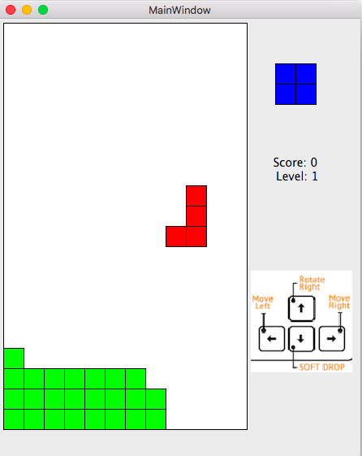

# Tetris Game 俄罗斯方块游戏

Tetris使用[Qt5](https://www.qt.io)C++开发。Mac用户可以直接下载`tetris.dmg`开始游戏。

## 游戏规则

由小方块组成的不同形状的板块陆续从屏幕上方落下来，玩家通过调整板块的位置和方向，使它们在屏幕底部拼出完整的一条或几条。这些完整的横条会随即消失，给新落下来的板块腾出空间，与此同时，玩家得到分数奖励。没有被消除掉的方块不断堆积起来，一旦堆到屏幕顶端，玩家便告输，游戏结束。

## 控制

使用方向键(上、左、右)控制俄罗斯方块移动，使用空格键加速落下。

